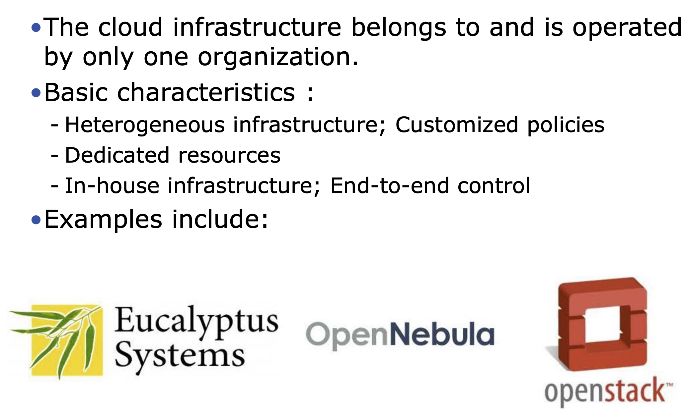
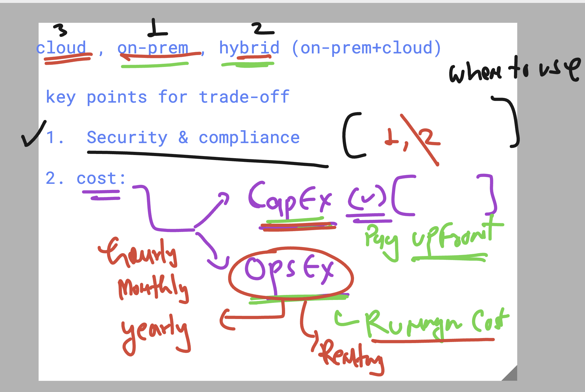
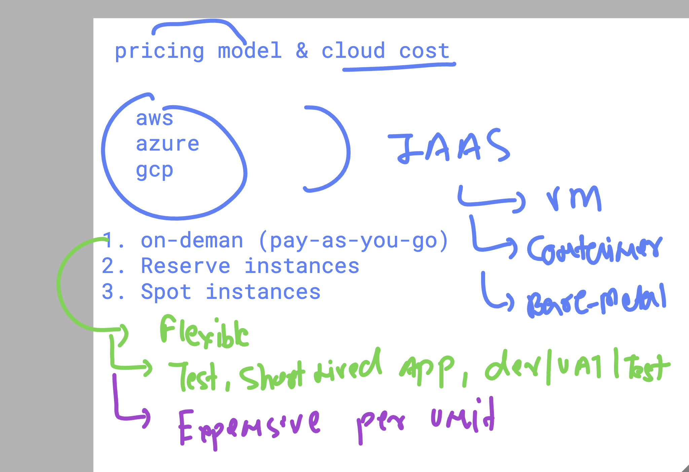
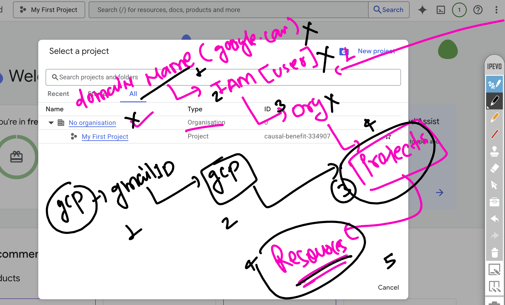
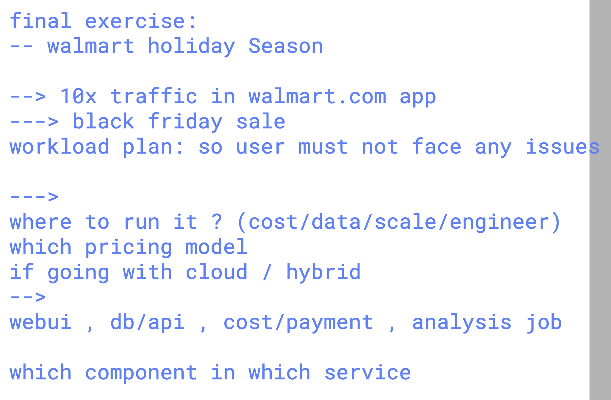

# walmart_TPM-sCloud_19thaug2025

### basic info about understanding resources for apps

### considering a normal webapp -to figure out resources 

### Resource planning -- in Cloud consideration 

## Cloud is  Network connection resources maintain by Providers 

### to use resources of cloud -- we use service type 

### understanding use case of webapp in a single Region 

### Cloud deployment methods 

### Private cloud deployment options 

### Decision making in selection of on-prem, hybrid and cloud 

## pricing model of cloud 

### GCP platform basic 

## Exercise for tomorrow before session 

