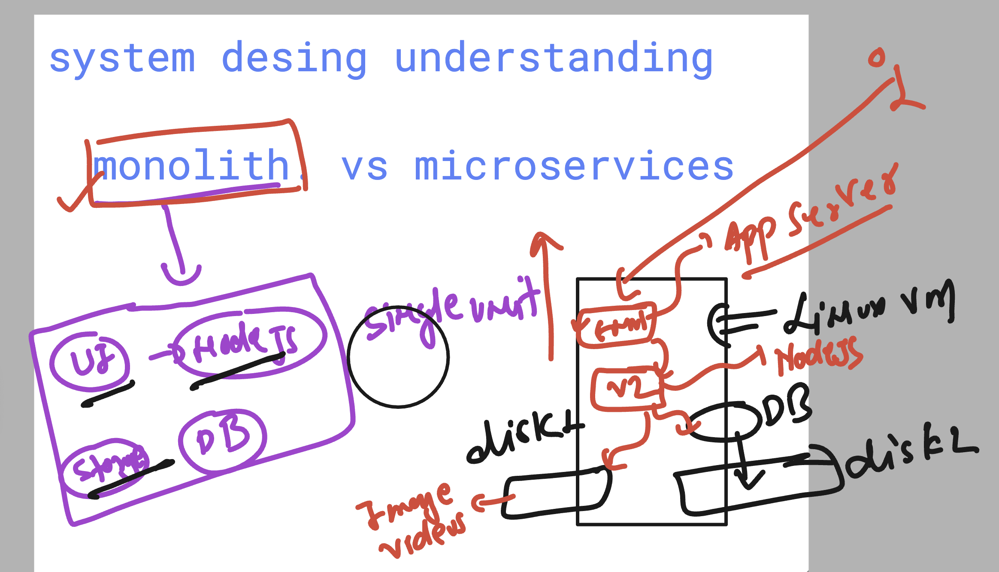
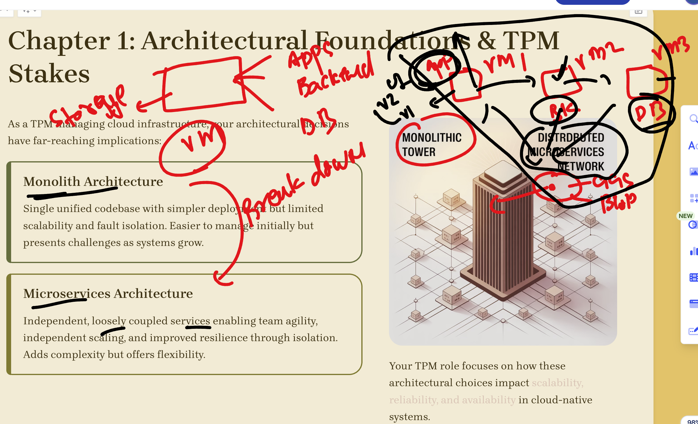
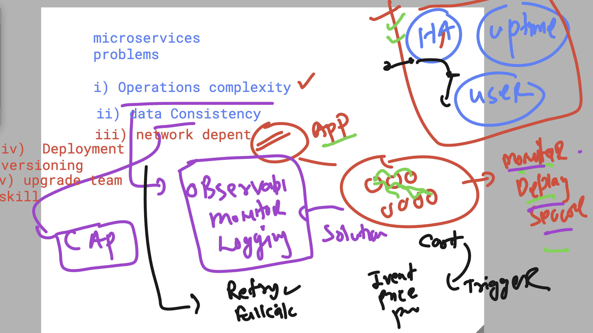
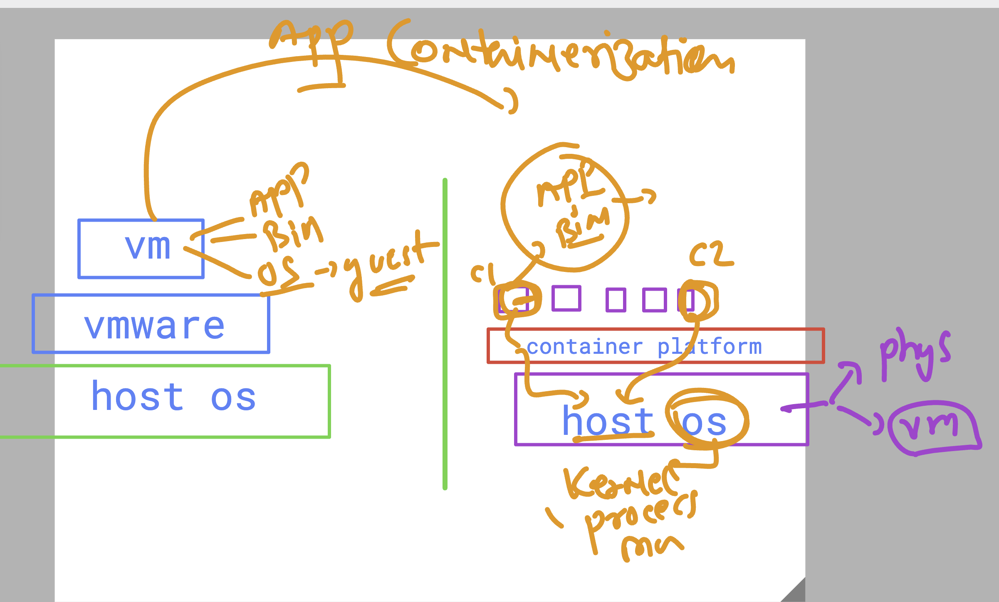
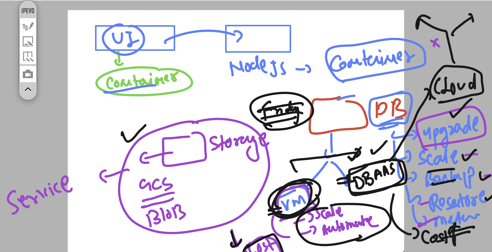
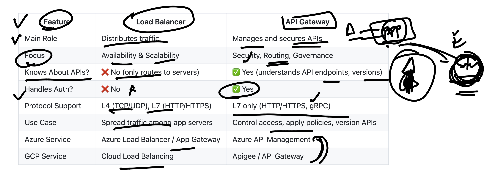

# walmart_TPM-sCloud_19thaug2025

### starting with app desing understanding 

### for app data -- exploring  cloud object storage vs  DB 

## system desing options 

### Monolith vs Microservices 

### Monolith app desing 

### breaking down monolith to  Microservices architecture 

### problem with microservices  to understand 

## to reduce cost and make app more faster scale other things  use containers

## Understanding the fit of current app 

### System Desing  LB vs APIgateway 

