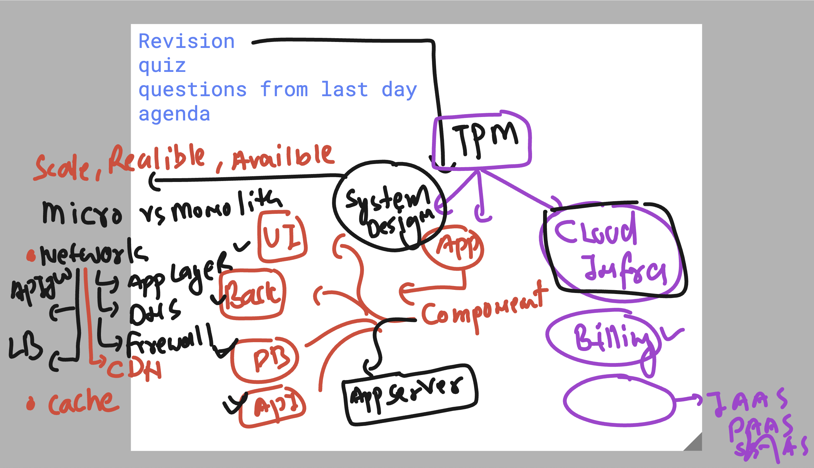
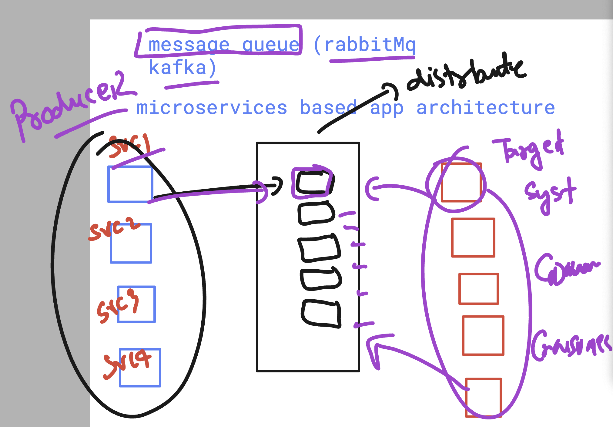
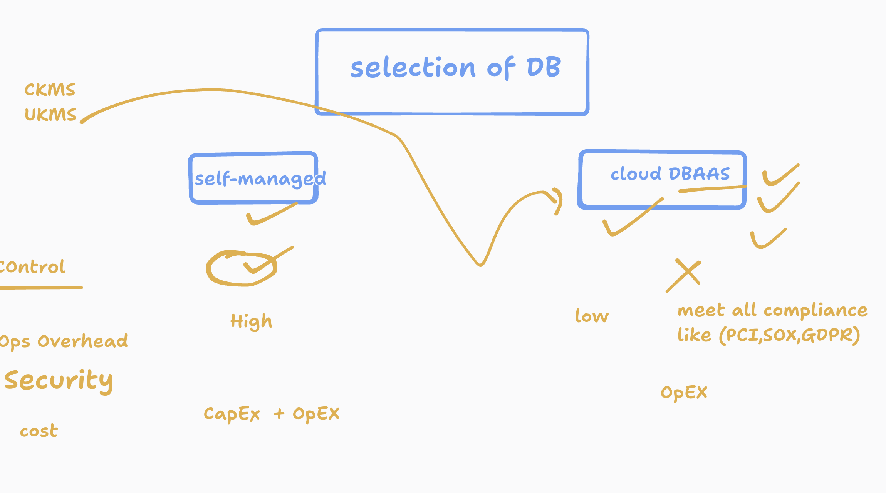

# walmart_TPM-sCloud_19thaug2025

### Revision Understanding 




### additional info about message queue service 




### Exploring DB option 



### creating python virtual env 

```
[ashutoshhsingh93@ashu-vm1 ~]$ python3  -m venv  storage-app
[ashutoshhsingh93@ashu-vm1 ~]$ 
[ashutoshhsingh93@ashu-vm1 ~]$ 
[ashutoshhsingh93@ashu-vm1 ~]$ source storage-app/bin/activate
(storage-app) [ashutoshhsingh93@ashu-vm1 ~]$ 
```

### For debain based OS

```
sudo apt update
sudo apt install python3-venv -y
python3  -m venv  storage-app
source storage-app/bin/activate

```


### Installing python module in any OS you have created as VM 

```
pip install flask  google-cloud-storage

```

### use git clone to copy application code 

```
 sudo apt install git -y  # only for debain based system 
git clone https://github.com/redashu/walmart_TPM-sCloud_19thaug2025.git 

cp  -rf  walmart_TPM-sCloud_19thaug2025/webapp/  . 
```


