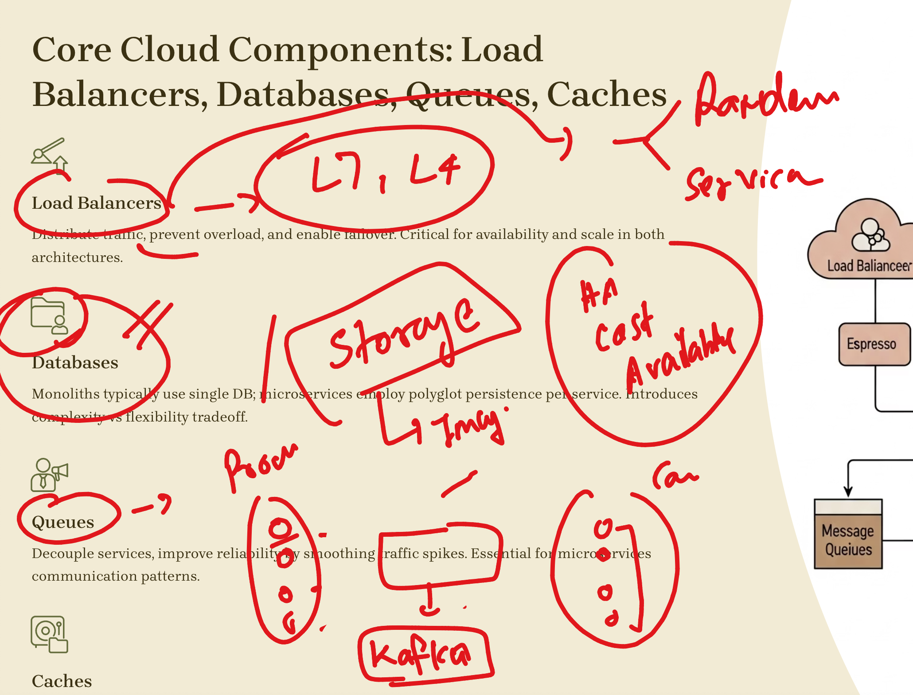
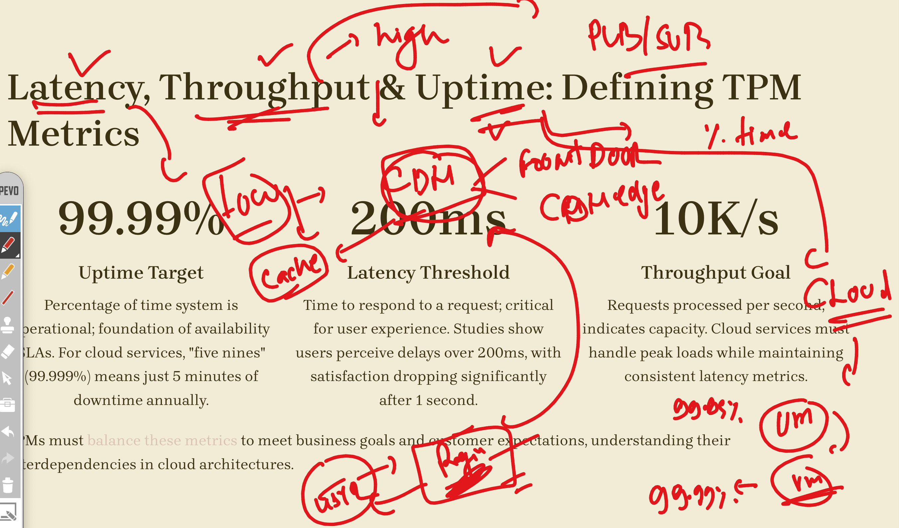

# walmart_TPM-sCloud_19thaug2025
## Overall Revision & New Concept Introduction

### Cloud Details Overview

### System Design Components

### Introduction to Service Mesh & Products

### Three Pillars in Application & System Design

## Understanding SLA, SLO, & SLI

## Additional Information

---

## Capstone Project: TPMs Design & Present a System

**Assignment:**  
Teams will design a system (example options: ridesharing backend or video streaming platform). The following aspects must be addressed:

- Cost vs. performance vs. maintainability
- Build vs. buy considerations
- Managing dependencies
- System and architecture diagrams
- PRD (Product Requirement Document) outline

**Tools for Reference:**
- Whiteboard or Lucidchart for diagrams
- GCP/Azure consoles for pricing and service comparisons

**Peer Review:**
- Each team presents their solution
- Other teams and instructor provide structured feedback